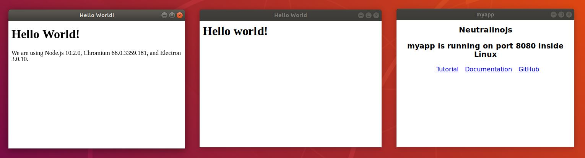
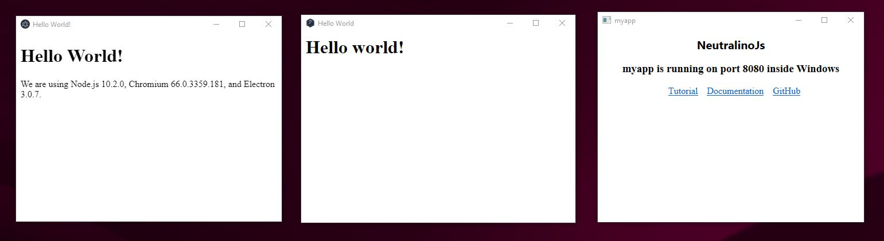
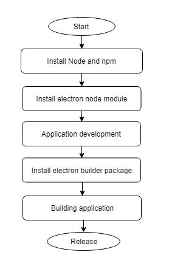
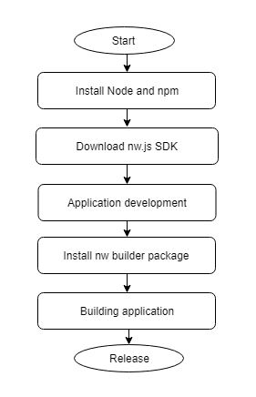
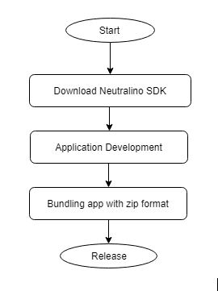
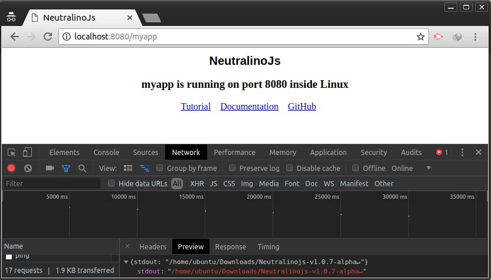

# Why Neutralinojs is better? — proof

[Neutralinojs](https://github.com/neutralinojs/neutralinojs) framework was evaluvated in comparison with Electron and NW.js considering disk consumption, memory consumption, easiness of development workflow and portability.

### Sample applications

Simple `Hello World` type application is used in each framework on Linux and Windows for the evaluation.


Figure 1: Sample cross-platform apps written using Electron, NW.js and Neutralino respectively on Linux.<br/><br/>


Figure 2: Sample cross-platform apps written using Electron, NW.js and Neutralino respectively on Windows.

#### OS details

- Ubuntu 18.04.1 LTS
- Windows 10 Enterprise


## 1. Disk Consumption

### Node Webkit

#### Linux

```
Zipped SDK size                   95.8 MB
Project Size                      1 KB
Application bundle                97.2 MB
Application bundle (zipped)       36.9 MB
File count of project             5         
```

#### Windows

```
Zipped SDK size                   72.7 MB
Project size                      2 KB
Application bundle                78.1 MB
Application bundle (zipped)       32.3 MB
File count of project             5
```

### Electron

#### Linux

```
Build package                     51.53 MB
node_modules count                147 
File count of project             1539
Project size                      136.4 MB
Application bundle                128.6 MB
Application bundle (zipped)       51.5 MB
```

#### Windows 

```
Build package                     53.16 MB
node_modules count                180 
File count of project             1368
Project size                      125 MB
Application bundle                118 MB
Application bundle (zipped)       50.4 MB
```


### Neutralinojs


#### Linux

```
Portable SDK size                 5.8 MB
Portable SDK size (zipped)        1.1 MB
File count                        11
```
#### Windows

```
Portable SDK size                 5.53 MB
Portable SDK size (zipped)        1.01 MB
File count                        11
```
SDK and application bundle are similar things in Neutralino. We will be introducing an application builder CLI soon!. Alternatively project can be zipped as the application bundle. Special case is that a single application bundle will work on both platforms unlike other frameworks do.

See [proof](https://github.com/neutralinojs/evaluation/tree/master/files/disk/proof) directory for sample sources and binary releases.

## 2. Memory consumption

### NW.js

```
Linux                           ~ 40 - 42 MB
Windows                         ~ 40 - 45 MB
```

### Electron

```
Linux                           ~ 62 - 65 MB
Windows                         ~ 45 - 50 MB
```

### Neutralinojs

```
Linux                           ~ 8 - 9 MB
Windows                         ~ 6 - 7 MB  
```

## 3. Easiness of Development Workflow

### Electron

<div align="center">
  
</div>

### NW.js

<div align="center">
  
</div>

### Neutralino

<div align="center">
  
</div>

### Neutralino Debugging

Neutralino app is served via a socket. Therefore debugging can be done using a web browser.


Figure 3: Debugging a Neutralino based app using Google Chrome.<br/><br/>

## 4. Performance

Neutralino's performance basically depends on the performance of C++ server implementation. Here is the result for `Neutralino.os.runCommand` for `ls` command for 100 samples. It took average 6 miliseconds to respond `ls` bash command.   

| Label        | # Samples | Average | Median | 90% Line | 95% Line | 99% Line | Min | Max | Error % | Throughput | Received KB/sec | Sent KB/sec | 
|--------------|-----------|---------|--------|----------|----------|----------|-----|-----|---------|------------|-----------------|-------------| 
| HTTP Request | 100       | 6       | 6      | 8        | 9        | 11       | 4   | 13  | 0.000%  | 87.87346   | 12.36           | 22.05       | 
| TOTAL        | 100       | 6       | 6      | 8        | 9        | 11       | 4   | 13  | 0.000%  | 87.87346   | 12.36           | 22.05       | 

Result was captured by [Apache JMeter](https://jmeter.apache.org/) using [this](https://github.com/neutralinojs/evaluation/blob/master/files/testing/REST/api_test.jmx) test plan. See more details about this report [here](http://www.testingjournals.com/understand-summary-report-jmeter/). 

## 5. Conclusion

According to the results of this expertiment Neutralino can be used as a lightweight alternative for Electron and NW.js. Furthermore another experiment needs to be done by using somewhat large cross platform application such as [draw.io](https://github.com/jgraph/drawio). There are some drawbacks such as Windows edition is based on IE etc.

## 6. Contribution

Refer guidelines [here](https://github.com/neutralinojs/neutralinojs#contribution)
